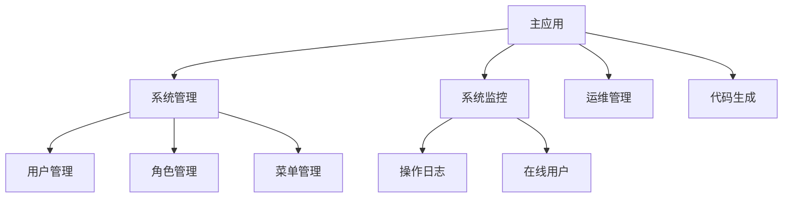
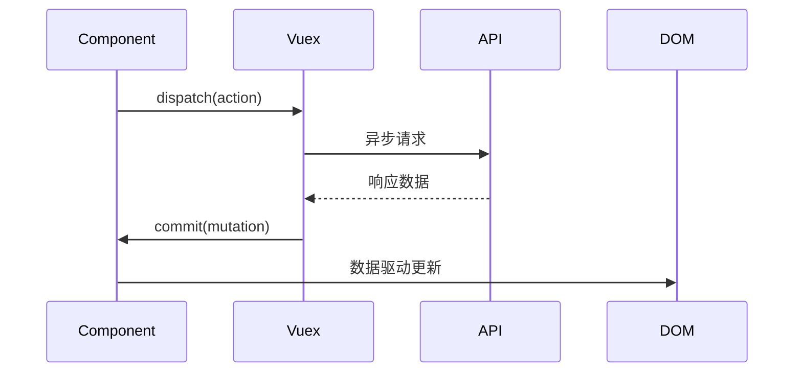

# ELADMIN 前端架构设计文档

## 1. 技术栈
- **核心框架**: Vue 2.6 + Element UI 2.15
- **状态管理**: Vuex 3.1
- **构建工具**: Vue CLI 3 + Webpack 4
- **代码规范**: ESLint Airbnb + Prettier + Husky
- **容器化**: Docker 20.10 + docker-compose 1.29

## 2. 架构设计
### 2.1 模块化架构


### 2.2 权限体系
- 路由守卫实现（permission.js）
- 按钮级权限控制（v-permission指令）
- 权限数据流示意图

## 3. 核心机制
### 3.1 请求封装
```javascript
// src/utils/request.js
const service = axios.create({
  baseURL: process.env.VUE_APP_BASE_API,
  timeout: 5000
})

// 请求拦截器
service.interceptors.request.use(config => {
  config.headers['Authorization'] = getToken()
  return config
})

// 响应拦截器
service.interceptors.response.use(response => {
  const res = response.data
  if (res.code !== 200) {
    showError(res)
    return Promise.reject(new Error(res.msg || 'Error'))
  }
  return res
})
```

### 3.2 状态管理


## 4. 开发规范
### 4.1 组件开发
| 类型       | 目录              | 命名规范         |
|------------|-------------------|------------------|
| 基础组件   | src/components    | BaseXXX.vue      |
| 业务组件   | src/views/components | FeatureXXX.vue |

### 4.2 Git规范
```bash
# 提交信息格式
feat(用户管理): 新增角色分配功能
fix(API): 修复分页参数传递问题
chore: 更新依赖版本
```

## 5. 容器化部署
### 5.1 基础设施
```bash
.
├── Dockerfile               # 多阶段构建配置
├── docker-compose.yml       # 服务编排
└── deploy/nginx.conf        # 生产环境Nginx配置
```

### 5.2 编排配置
```yaml
# docker-compose.yml核心配置
services:
  web:
    build: 
      context: .
      dockerfile: Dockerfile
    ports:
      - "8080:80"
    environment:
      - TZ=Asia/Shanghai
    healthcheck:
      test: ["CMD", "curl", "-f", "http://localhost/health"]
      interval: 30s
      timeout: 10s
      retries: 3

networks:
  eladmin-net:
    driver: bridge
```

### 5.3 部署操作
```bash
# 生产环境部署流程
1. git clone https://github.com/elunez/eladmin-web.git
2. cd eladmin-web
3. docker-compose up --build -d
4. 访问 http://<服务器IP>:8080
```

## 6. 扩展能力
### 6.1 微前端集成方案
```javascript
// 乾坤微前端配置
export default {
  apps: [
    {
      name: 'subapp',
      entry: '//localhost:7100',
      container: '#subapp',
      activeRule: '/subapp'
    }
  ]
}
```

### 6.2 性能监控
```javascript
// 使用Sentry进行错误监控
Sentry.init({
  dsn: 'https://xxx@sentry.io/xxx',
  integrations: [new VueIntegration({Vue, attachProps: true})]
})